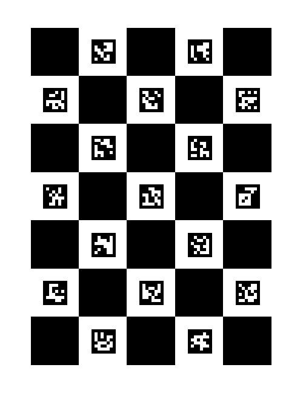
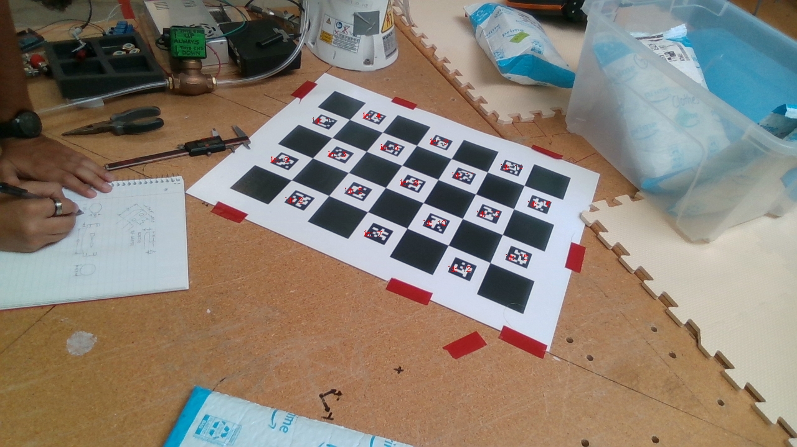

# camera_calibration

For disCoeffs and Camera pose estimation using a 7 x 5 ChAruco marker board



## disCoeffs

### Recording
Film the board from different angle with the camera you want to calibrate with in 1280 X 720 resolution, store to dir/. 

### Compile app
```
make clean
make app
```

### Useage
Read your camera intrinsic 
```
./app dir/ fx fy dx dy
```
It will print 5 value diffcoeff

## Camera transformation from camera space to world space

detect_marker.py
```
OFFSET_X = 0.046
OFFSET_Y = 0.049
CHESSBOARD_GRID_SIZE = 0.073
MARKER_SIZE = 0.0365

img_root = "path/store/img"
img_name = "img/want2calibrate/with"
# intrinsic
intrinsic = np.array([918.77, 0, 642.55, 0, 918.53, 367.84, 0, 0, 1])
# disCoeffs
disCoeffs = np.array([0.1264535476209261, -0.3306752898091085, -0.005525292384111444, 0.002419558666654123, 0.2048257682338653])
```
### Output
marker_pose.json will store all marker corner uv and xyz.\
Transformation will be printed.

